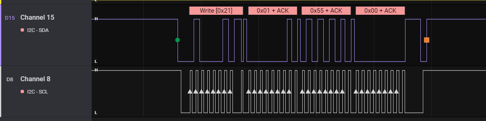
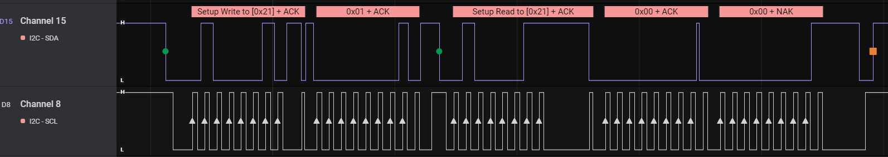

### stm32_i2c_slave_examlpe


```
root@orangepione:~# i2cdetect -y 2
     0  1  2  3  4  5  6  7  8  9  a  b  c  d  e  f
00:          -- -- -- -- -- -- -- -- -- -- -- -- --
10: -- -- -- -- -- -- -- -- -- -- -- -- -- -- -- --
20: -- 44 -- -- -- -- -- -- -- -- -- -- -- -- -- --
30: -- -- -- -- -- -- -- -- -- -- -- -- -- -- -- --
40: -- -- -- -- -- -- -- -- -- -- -- -- -- -- -- --
50: -- -- -- -- -- -- -- -- -- -- -- -- -- -- -- --
60: -- -- -- -- -- -- -- -- -- -- -- -- -- -- -- --
70: -- -- -- -- -- -- -- --
root@orangepione:~# i2cget -y 2 0x44 0x00
0x01
root@orangepione:~# i2cget -y 2 0x44 0x01 w
0x0000
root@orangepione:~# i2cget -y 2 0x44 0x11 w
0x3344
root@orangepione:~# i2cset -y 2 0x44 0x01 0x0055 w
root@orangepione:~# i2cget -y 2 0x44 0x01 w
0x0055
root@orangepione:~# i2cget -y 2 0x44 0x11 w
0x3345
```


**i2cset -y 2 0x44 0x01 0x0055 w**


**i2cget -y 2 0x44 0x01 w**


What was really hard to find was an adequate example of implementing an i2c slave on STM32 using interrupts. There were several examples of blocking implementations and a couple of questions on st-community.

But a more or less working project, where there is an implementation of **several** registers of the slave device, and even with a **different level of access** - this was very lacking.

In general, I reached the bottom of the comedy. I liked how it worked on **mbedOS**, so I got into the sources (https://github.com/ARMmbed/mbed-os and https://github.com/ARMmbed/mbed-hal). And he began to read the code sadly and sweepingly cut unnecessary dependencies.

The logic of the OS firmware is as follows - there are interrupt handlers that fill / empty buffers, set ready flags, and try to work out errors. In the “main” loop, these flags are read and the program performs certain actions depending on the flags set - it writes or outputs data.

In general, we got a small example, more or less universal for STM32 devices. This project was made for the most popular **Nucleo-F303RE** debug board on Aliexpress.

Checked on STM32L433, STM32F302R8

**The function to control the bit timeout is still very bad, adapt to yourself or wait for an update**

***

Вот что действительно было тяжело найти, так это адекватный пример реализации i2c подчиненного устройства на STM32 с использованием прерываний. Нашлись несколько примеров блокирующих реализаций и пара вопросов на st-community.

А вот более-менее рабочий проект, где есть реализация **нескольких** регистров ведомого устройства, да еще и с **разным уровнем доступа** – такого очень не хватало.

В общем, я достиг <del>комедии</del> дна. Мне понравилось, как работало на **mbedOS**, поэтому, я полез в исходники (https://github.com/ARMmbed/mbed-os и https://github.com/ARMmbed/mbed-hal). И начал грустно вычитывать код и размашисто резать лишние зависимости.

Логика работы следующая – есть обработчики прерываний, которые заполняют/опустошают буфферы, выставляют флажки готовности, пытаются отработать ошибки. В “основном” цикле эти флажки читаются и программа выполняет определенные действия в зависимости от установленных флажков – записывает или выдает данные.

В общем, получился небольшой пример, более-менее универсальный для STM32-устройств. Данный проект сделан для самой популярной на Алиэкспесс платы-отладки **Nucleo-F303RE**

Проверено на STM32L433, STM32F302R8

**Функция для контроля таймаута бита пока очень плоха, адаптируйте под себя или ждите обновление**